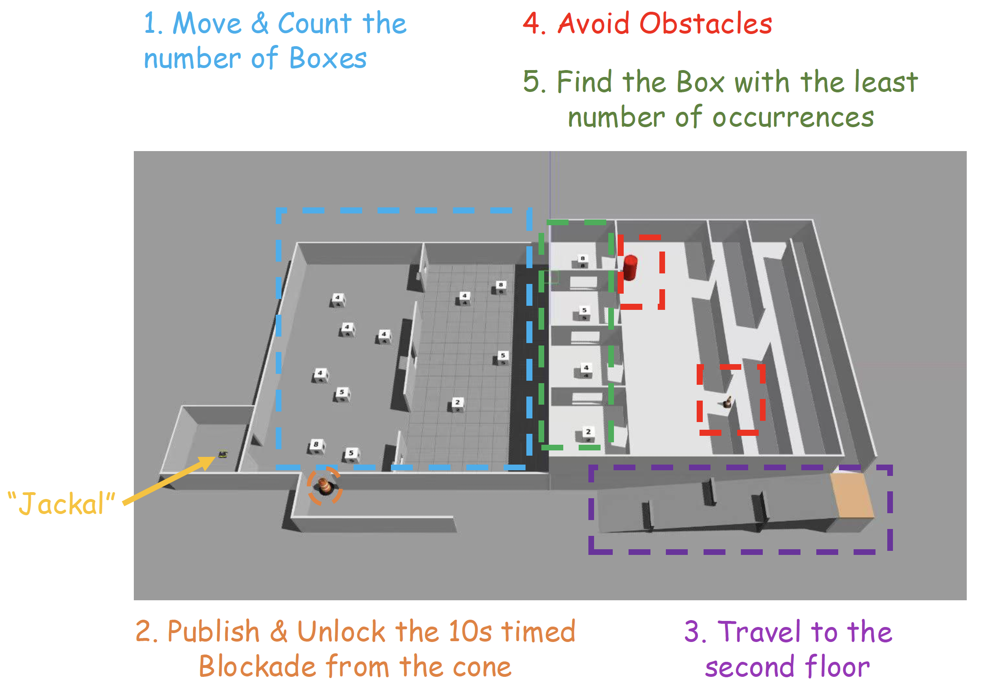
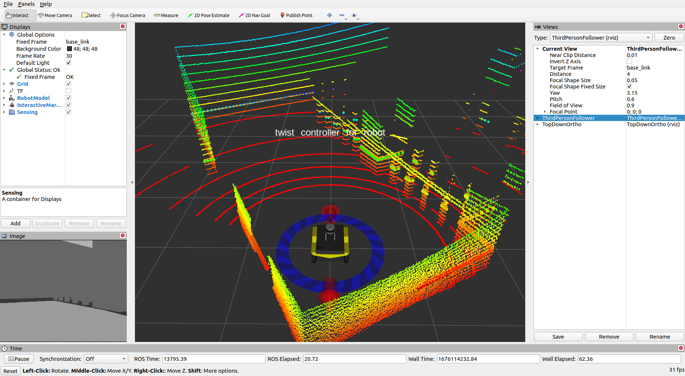
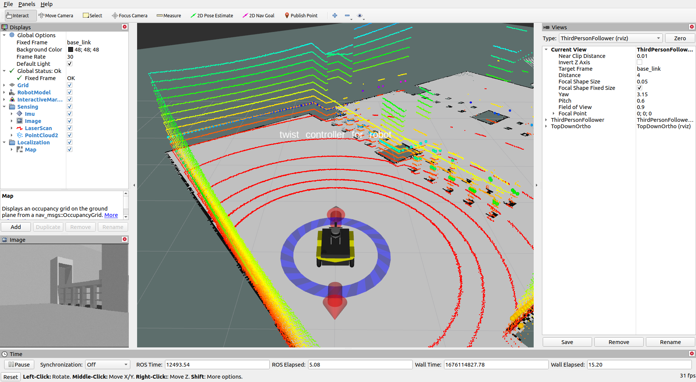
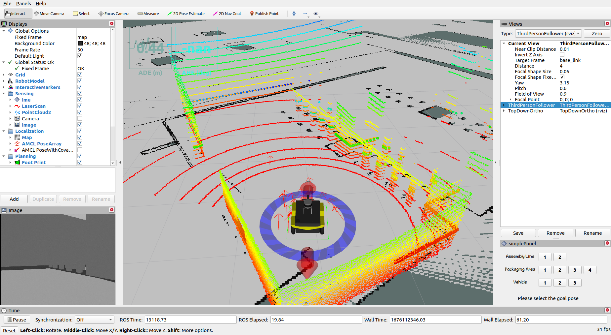
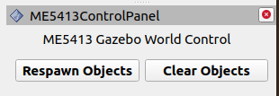

# ME5413 — Autonomous Mobile Robotics (Final Project)

[](https://ubuntu.com/)
[](http://wiki.ros.org/noetic)
[](LICENSE)

**Autonomous navigation for a Clearpath Jackal in a Gazebo multi-floor warehouse world** — mapping with 2D LiDAR, localization with AMCL, vision-based perception (YOLOv5 + OCR), and a scripted mission state machine for the NUS ME5413 course project (AY25/26).



## Demo

Autonomous run (single session) — screen recording:

<video src="media/ME5413_demo.mp4" controls muted playsinline width="100%">
  Video not shown in your viewer — open <a href="media/ME5413_demo.mp4"><code>media/ME5413_demo.mp4</code></a> or use the file on GitHub.
</video>

Direct file: [`media/ME5413_demo.mp4`](media/ME5413_demo.mp4)

---

## At a glance

| Layer | What this repo uses |
|--------|---------------------|
| **Simulation** | Gazebo world `me5413_project_2526`, Jackal with sensors, randomised props & moving obstacle |
| **Mapping** | Course default **GMapping** *or* bundled **[slam_toolbox](https://github.com/SteveMacenski/slam_toolbox)** (async online SLAM) |
| **Localization** | **AMCL** (particle filter MCL on a saved map) |
| **Planning / control** | ROS navigation stack (`move_base`, global/local planners) as wired in `navigation.launch` |
| **Perception** | **YOLOv5** (cone / obstacle cues) and **EasyOCR** (digit recognition on numbered boxes & rooms) via `yolov5_detector` |
| **Mission logic** | Python state machine `task_executor.py` + helpers (e.g. initial pose publisher, world plugins) |

Ground-truth topics (e.g. `/gazebo/ground_truth/state`) are **not** used in the autonomous solution — consistent with course rules.

---

## Repository layout

This is a **ROS Noetic catkin workspace**. Main packages under `src/`:

| Package | Role |
|---------|------|
| `me5413_world` | Gazebo world, launches (world / teleop / mapping / navigation), maps, RViz configs, Gazebo plugins, **`scripts/task_executor.py`** |
| `jackal_description` | Jackal URDF / xacro and meshes |
| `interactive_tools` | RViz panel plugin to spawn / clear random objects |
| `slam_toolbox` (+ msgs, rviz, `karto_sdk`) | 2D SLAM as an alternative to GMapping |
| `amcl` | AMCL built from source in-tree (v1.17.x) |
| `yolov5_detector` | Camera pipeline: YOLOv5 + EasyOCR nodes |

Upstream course template: [NUS-Advanced-Robotics-Centre/ME5413_Final_Project](https://github.com/NUS-Advanced-Robotics-Centre/ME5413_Final_Project).

---

## Prerequisites

- **Ubuntu 20.04** (recommended)
- **ROS Noetic** (`desktop-full` or equivalent + navigation / perception stacks)
- **Catkin** toolchain (`catkin_make`)
- **Gazebo** models (official + project models — see below)

Standard ROS dependencies are declared in package `package.xml` files; use `rosdep` to pull them in.

### Python (perception)

The `yolov5_detector` nodes expect a Python environment with **PyTorch**, **OpenCV**, and **EasyOCR** (and YOLOv5 utils under `src/yolov5_detector/yolov5/`). Install versions compatible with your CUDA/CPU setup; GPU is optional but supported in the scripts.

---

## Build & source

```bash
cd <path-to-workspace>
rosdep install --from-paths src --ignore-src -r -y
# Optional: extra simulation packages (if rosdep misses any)
sudo apt install -y ros-noetic-sick-tim ros-noetic-lms1xx ros-noetic-velodyne-description \
  ros-noetic-pointgrey-camera-description ros-noetic-jackal-control
catkin_make
source devel/setup.bash
```

---

## Gazebo models

Copy assets into `~/.gazebo/models/`:

1. **Official models** — clone [osrf/gazebo_models](https://github.com/osrf/gazebo_models) and copy into `~/.gazebo/models`.
2. **Project models** — copy `src/me5413_world/models/*` to `~/.gazebo/models`.

---

## Quick start

### 0 — World + robot

```bash
roslaunch me5413_world world.launch
```

### 1 — Teleop (optional exploration)

```bash
roslaunch me5413_world manual.launch
```

### 2 — Mapping

**Option A — GMapping (course default)**

```bash
roslaunch me5413_world mapping.launch
# Save map (example)
roscd me5413_world/maps
rosrun map_server map_saver -f my_map map:=/map
```

**Option B — slam_toolbox (recommended in this workspace)**

```bash
roslaunch me5413_world slam_toolbox_mapping.launch
# Save map the same way once /map is published
```

### 3 — Navigation + full stack

After a map exists under `me5413_world/maps/`:

```bash
roslaunch me5413_world navigation.launch
```

This brings up localization, planners, RViz, and the integrated perception / mission nodes as defined in the launch file.

---

## Mission (course brief, short)

Typical objectives include: counting numbered boxes on the lower floor, unblocking the exit via `/cmd_unblock` (`std_msgs/Bool`), reaching the upper floor via the ramp, choosing the correct corridor when a cone blocks one gap, avoiding the moving “pedestrian”, and **stopping in the room whose digit appears least often** on the lower floor — all **without** cheating ground-truth odometry or box topics.

---

## Configuration notes

- **Waypoints / goals**: see `me5413_world/config/config.yaml` and parameters loaded in launch files.
- **Maps**: `me5413_world/maps/` (`my_map.yaml` / `my_map.pgm` in this project).
- **RViz**: configs under `me5413_world/rviz/` (`navigation.rviz`, `slam_toolbox.rviz`, etc.).

For a deeper **architecture / topic-level** description (Chinese), see `PROJECT_ARCHITECTURE.md` in this workspace if present.

---

## Screenshots

| Manual / teleop | Mapping | Navigation |
|-----------------|---------|------------|
|  |  |  |

RViz object panel:



---

## Contributing & course policy

Bugfixes and improvements are welcome via PRs to the upstream course repo when appropriate. For assignment rules, deadlines, and grading, follow the **official ME5413 Canvas / brief**.

---

## License

This project inherits the **MIT** license from the course template — see [`LICENSE`](LICENSE).
